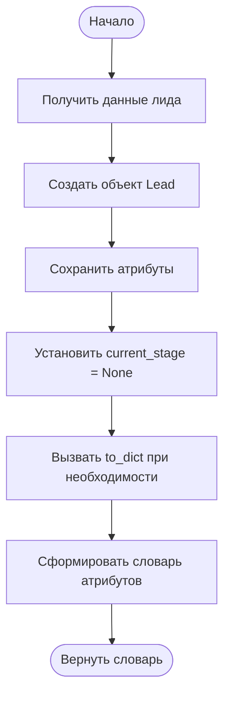
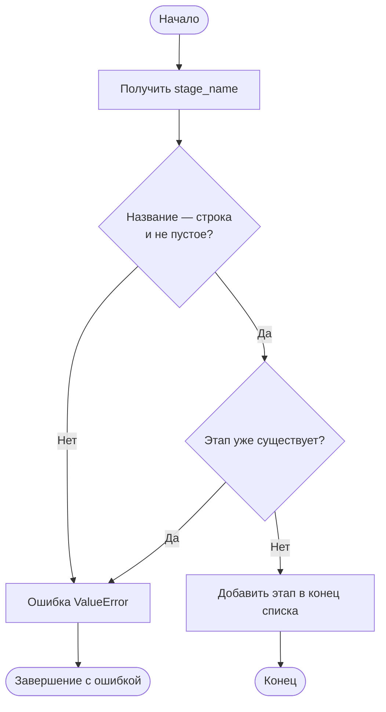
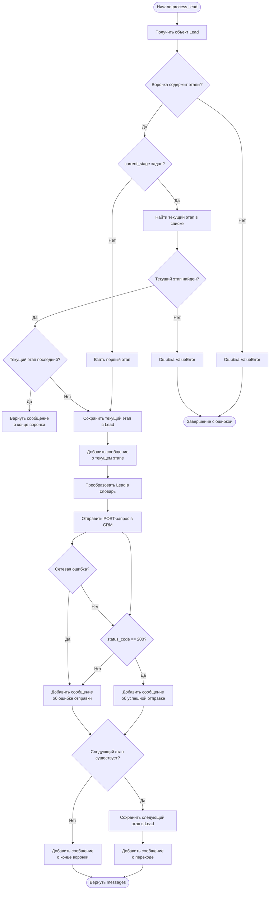

# Псевдокод и блок-схемы для системы Lead / Simulator / SalesFunnel

Документ описывает все основные задания текущего проекта: создание лида, создание симулятора, формирование воронки, добавление этапов и обработку лида через CRM.

## 1. Общая структура системы

```text
Lead
 ├─ lead_id
 ├─ datetime
 ├─ page
 ├─ form_title
 ├─ contacts
 ├─ name
 ├─ current_stage
 └─ to_dict()

Simulator
 ├─ simulator_type
 ├─ version
 └─ to_dict()

SalesFunnel
 ├─ stages
 ├─ crm_url
 ├─ add_stage(stage_name)
 └─ process_lead(lead)
```

## 2. Псевдокод класса `Lead`

### Создание объекта `Lead`

```text
АЛГОРИТМ СОЗДАНИЯ ЛИДА

ВХОД:
    lead_id       — идентификатор лида
    datetime      — дата и время заявки
    page          — страница сайта
    form_title    — название формы
    contacts      — контактные данные
    name          — имя лида

СОЗДАТЬ объект Lead
СОХРАНИТЬ lead_id в объекте
СОХРАНИТЬ datetime в объекте
СОХРАНИТЬ page в объекте
СОХРАНИТЬ form_title в объекте
СОХРАНИТЬ contacts в объекте
СОХРАНИТЬ name в объекте
УСТАНОВИТЬ current_stage = None

ВЕРНУТЬ объект Lead
КОНЕЦ АЛГОРИТМА
```

### Метод `Lead.to_dict()`

```text
АЛГОРИТМ LEAD_TO_DICT

СОЗДАТЬ пустой словарь result

ЗАПИСАТЬ в result:
    result["lead_id"] = lead_id
    result["datetime"] = datetime
    result["page"] = page
    result["form_title"] = form_title
    result["contacts"] = contacts
    result["name"] = name

ВЕРНУТЬ result
КОНЕЦ АЛГОРИТМА
```

### Блок-схема создания лида и преобразования в словарь



## 3. Псевдокод класса `Simulator`

### Создание объекта `Simulator`

```text
АЛГОРИТМ СОЗДАНИЯ СИМУЛЯТОРА

ВХОД:
    simulator_type — тип симулятора
    version        — версия симулятора

СОЗДАТЬ объект Simulator
СОХРАНИТЬ simulator_type в объекте
СОХРАНИТЬ version в объекте

ВЕРНУТЬ объект Simulator
КОНЕЦ АЛГОРИТМА
```

### Метод `Simulator.to_dict()`

```text
АЛГОРИТМ SIMULATOR_TO_DICT

СОЗДАТЬ словарь result:
    result["simulator_type"] = simulator_type
    result["version"] = version

ВЕРНУТЬ result
КОНЕЦ АЛГОРИТМА
```

## 4. Псевдокод класса `SalesFunnel`

### Создание воронки

```text
АЛГОРИТМ СОЗДАНИЯ ВОРОНКИ

ВХОД:
    stages  — необязательный список этапов
    crm_url — адрес CRM

СОЗДАТЬ пустой список stages в объекте воронки
СОХРАНИТЬ crm_url в объекте

ЕСЛИ список stages передан:
    ДЛЯ каждого stage в списке:
        ВЫЗВАТЬ add_stage(stage)

ВЕРНУТЬ объект SalesFunnel
КОНЕЦ АЛГОРИТМА
```

### Метод `add_stage(stage_name)`

```text
АЛГОРИТМ ДОБАВЛЕНИЯ ЭТАПА

ВХОД:
    stage_name — название нового этапа

ЕСЛИ stage_name не является строкой:
    ВЫЗВАТЬ ошибку ValueError

УДАЛИТЬ пробелы в начале и конце stage_name

ЕСЛИ stage_name пустой:
    ВЫЗВАТЬ ошибку ValueError

ЕСЛИ stage_name уже есть в списке stages:
    ВЫЗВАТЬ ошибку ValueError

ДОБАВИТЬ stage_name в конец списка stages

ВЕРНУТЬ управление вызывающей программе
КОНЕЦ АЛГОРИТМА
```

### Блок-схема `add_stage`



## 5. Псевдокод метода `process_lead(lead)`

Один вызов метода обрабатывает **только один этап** воронки.

```text
АЛГОРИТМ PROCESS_LEAD

ВХОД:
    lead — объект Lead

ВЫХОД:
    список сообщений messages

ЕСЛИ lead не является объектом Lead:
    ВЫЗВАТЬ ошибку TypeError

ЕСЛИ список stages пуст:
    ВЫЗВАТЬ ошибку ValueError

ЕСЛИ lead.current_stage равен None:
    stage_index = 0
ИНАЧЕ:
    НАЙТИ индекс lead.current_stage в списке stages

    ЕСЛИ текущий этап отсутствует в списке stages:
        ВЫЗВАТЬ ошибку ValueError

    ЕСЛИ текущий этап является последним:
        ВЕРНУТЬ список:
            "Лид {lead_id} достиг конца воронки"

current_stage = stages[stage_index]
lead.current_stage = current_stage

СОЗДАТЬ список messages
ДОБАВИТЬ в messages:
    "Обработка лида {lead_id} - Текущий этап: {current_stage}"

ПРЕОБРАЗОВАТЬ lead в словарь через lead.to_dict()

ПОПЫТАТЬСЯ:
    ОТПРАВИТЬ POST-запрос на crm_url
    ПЕРЕДАТЬ словарь лида в JSON
    УСТАНОВИТЬ timeout = 10 секунд

    ЕСЛИ response.status_code равен 200:
        ДОБАВИТЬ в messages:
            "Данные лида успешно отправлены в CRM"
    ИНАЧЕ:
        ДОБАВИТЬ в messages:
            "Не удалось отправить данные лида в CRM"

ЕСЛИ возникла сетевая ошибка:
    ДОБАВИТЬ в messages:
        "Не удалось отправить данные лида в CRM"

ЕСЛИ существует следующий этап:
    next_stage = stages[stage_index + 1]
    lead.current_stage = next_stage
    ДОБАВИТЬ в messages:
        "Перемещаем лид {lead_id} на следующий этап: {next_stage}"
ИНАЧЕ:
    ДОБАВИТЬ в messages:
        "Лид {lead_id} достиг конца воронки"

ВЕРНУТЬ messages
КОНЕЦ АЛГОРИТМА
```

### Подробная блок-схема `process_lead`



## 6. Алгоритм повторной обработки завершённого лида

```text
АЛГОРИТМ ПОВТОРНОЙ ОБРАБОТКИ

ВЫЗВАТЬ process_lead(lead)

ЕСЛИ lead.current_stage является последним этапом:
    НЕ отправлять запрос в CRM повторно
    ВЕРНУТЬ:
        "Лид {lead_id} достиг конца воронки"

КОНЕЦ АЛГОРИТМА
```

## 7. Пример полного сценария

```text
НАЧАЛО

Создать Lead
Создать Simulator
Создать SalesFunnel с этапами:
    "Новая заявка"
    "Квалификация"
    "Продажа"

Вызвать process_lead(lead)
Лид находится на этапе "Новая заявка"
Отправить данные в CRM
Переместить лида на этап "Квалификация"

Вызвать process_lead(lead) повторно
Лид находится на этапе "Квалификация"
Отправить данные в CRM
Переместить лида на этап "Продажа"

Вызвать process_lead(lead) ещё раз
Лид находится на этапе "Продажа"
Отправить данные в CRM
Сообщить, что лид достиг конца воронки

Вызвать process_lead(lead) снова
Не отправлять данные повторно
Вернуть сообщение о конце воронки

КОНЕЦ
```

## 8. Краткое соответствие псевдокода Python-коду

| Псевдокод | Python |
|---|---|
| Создать объект лида | `lead = Lead(...)` |
| Преобразовать лида в словарь | `lead.to_dict()` |
| Создать воронку | `funnel = SalesFunnel(...)` |
| Добавить этап | `funnel.add_stage("Квалификация")` |
| Обработать один этап | `funnel.process_lead(lead)` |
| Текущий этап лида | `lead.current_stage` |
| Отправить данные в CRM | `requests.post(...)` |
| Проверить успех | `response.status_code == 200` |
| Перейти дальше | `lead.current_stage = next_stage` |
