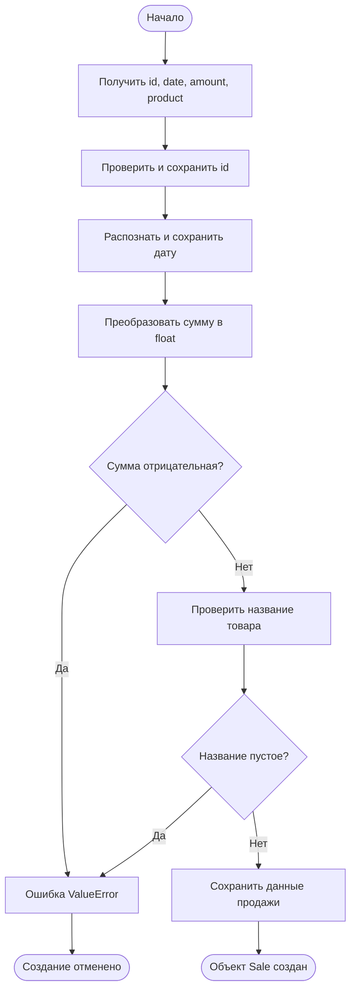
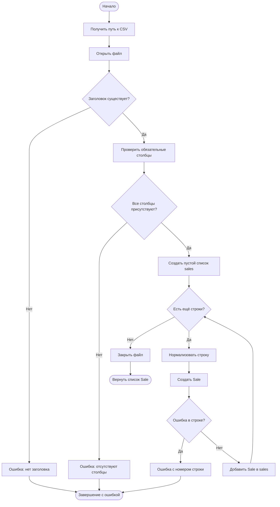
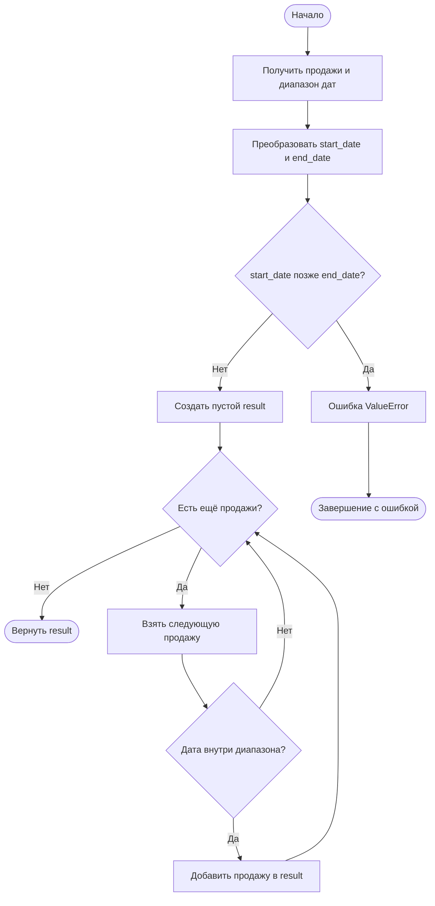
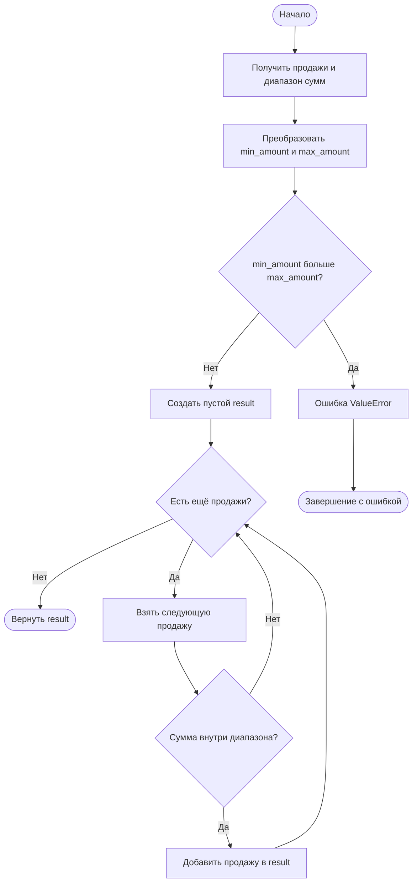
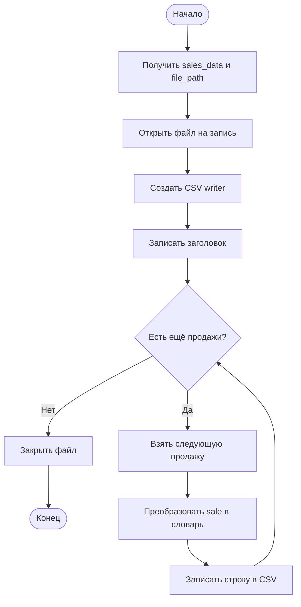
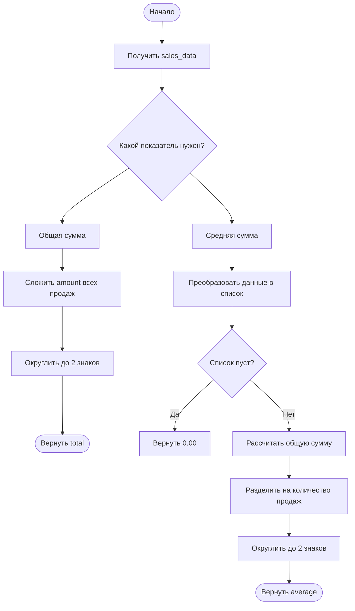
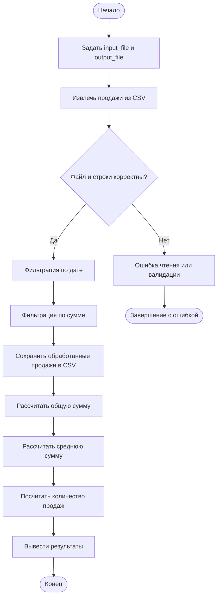

# Псевдокод и блок-схемы ETL-системы продаж

Документ подготовлен по прикреплённому файлу. Он описывает классы `Sale`, `Extraction`, `Transformation`, `Loading`, `Analysis`, а также полный сценарий ETL: извлечение данных из CSV, фильтрацию, сохранение и анализ.

## 1. Общая схема ETL

```text
CSV-файл
   |
   v
Extraction.from_csv()
   |
   v
Список объектов Sale
   |
   v
Transformation.filter_by_date()
   |
   v
Transformation.filter_by_amount()
   |
   v
Отфильтрованный список Sale
   |                    \
   |                     \
   v                      v
Loading.to_csv()       Analysis
   |                      |
   v                      v
Новый CSV-файл         Общая и средняя сумма
```

## 2. Импорты

```text
ПОДКЛЮЧИТЬ csv
    Для чтения и записи CSV-файлов.

ПОДКЛЮЧИТЬ date и datetime
    Для хранения и преобразования дат.

ПОДКЛЮЧИТЬ Path
    Для работы с путями к файлам.

ПОДКЛЮЧИТЬ Iterable
    Для методов, принимающих любые перебираемые коллекции продаж.
```

## 3. Класс `Sale`

### 3.1. Создание продажи

```text
АЛГОРИТМ СОЗДАНИЯ SALE

ВХОД:
    sale_id   — идентификатор продажи
    sale_date — дата продажи
    amount    — сумма продажи
    product   — название товара

ВЫЗВАТЬ set_id(sale_id)
ВЫЗВАТЬ set_date(sale_date)
ВЫЗВАТЬ set_amount(amount)
ВЫЗВАТЬ set_product(product)

ЕСЛИ все проверки пройдены:
    ВЕРНУТЬ объект Sale
ИНАЧЕ:
    ВЫЗВАТЬ соответствующую ошибку

КОНЕЦ АЛГОРИТМА
```

### 3.2. Разбор даты `_parse_date(value)`

```text
АЛГОРИТМ PARSE_DATE

ВХОД: value

ЕСЛИ value является datetime:
    ВЕРНУТЬ только дату из value

ЕСЛИ value является date:
    ВЕРНУТЬ value

ЕСЛИ value является строкой:
    УДАЛИТЬ пробелы по краям

    ДЛЯ каждого формата:
        "%Y-%m-%d"
        "%d.%m.%Y"
        "%d/%m/%Y"

        ПОПЫТАТЬСЯ преобразовать строку в дату
        ЕСЛИ преобразование успешно:
            ВЕРНУТЬ дату
        ИНАЧЕ:
            перейти к следующему формату

ЕСЛИ ни один формат не подошёл:
    ВЫЗВАТЬ ValueError

КОНЕЦ АЛГОРИТМА
```

### 3.3. Установка идентификатора

```text
АЛГОРИТМ SET_ID

ВХОД: value

ЕСЛИ value отсутствует или пуст после удаления пробелов:
    ВЫЗВАТЬ ValueError

ПОПЫТАТЬСЯ преобразовать value в целое число

ЕСЛИ преобразование удалось:
    СОХРАНИТЬ целое число в __id
ИНАЧЕ:
    СОХРАНИТЬ очищенную строку в __id

КОНЕЦ АЛГОРИТМА
```

### 3.4. Установка даты

```text
АЛГОРИТМ SET_DATE

ВХОД: value

ВЫЗВАТЬ _parse_date(value)
СОХРАНИТЬ полученную дату в __date

КОНЕЦ АЛГОРИТМА
```

### 3.5. Установка суммы

```text
АЛГОРИТМ SET_AMOUNT

ВХОД: value

ЕСЛИ value является строкой:
    УДАЛИТЬ пробелы
    ЗАМЕНИТЬ запятую на точку

ПРЕОБРАЗОВАТЬ value в число с плавающей точкой

ЕСЛИ amount меньше нуля:
    ВЫЗВАТЬ ValueError

СОХРАНИТЬ amount в __amount
КОНЕЦ АЛГОРИТМА
```

### 3.6. Установка товара

```text
АЛГОРИТМ SET_PRODUCT

ВХОД: value

ЕСЛИ value отсутствует или пуст после удаления пробелов:
    ВЫЗВАТЬ ValueError

СОХРАНИТЬ очищенное значение в __product
КОНЕЦ АЛГОРИТМА
```

### 3.7. Преобразование продажи в словарь

```text
АЛГОРИТМ SALE_TO_DICT

СОЗДАТЬ словарь result:
    result["id"] = идентификатор продажи
    result["date"] = дата в формате YYYY-MM-DD
    result["amount"] = сумма с двумя знаками после запятой
    result["product"] = название товара

ВЕРНУТЬ result
КОНЕЦ АЛГОРИТМА
```

### 3.8. Блок-схема создания `Sale`



## 4. Класс `Extraction`

### 4.1. Метод `from_csv(file_path)`

```text
АЛГОРИТМ EXTRACTION_FROM_CSV

ВХОД: file_path
ВЫХОД: список объектов Sale

ОПРЕДЕЛИТЬ обязательные столбцы:
    id, date, amount, product

СОЗДАТЬ пустой список sales

ОТКРЫТЬ CSV-файл в режиме чтения
    использовать кодировку UTF-8 с поддержкой BOM
    отключить преобразование новых строк

СОЗДАТЬ CSV DictReader

ЕСЛИ заголовок отсутствует:
    ВЫЗВАТЬ ValueError

ПОЛУЧИТЬ названия столбцов
ПРИВЕСТИ их к нижнему регистру
УДАЛИТЬ пробелы

НАЙТИ отсутствующие обязательные столбцы

ЕСЛИ отсутствующие столбцы есть:
    ВЫЗВАТЬ ValueError

ДЛЯ каждой строки CSV:
    НОРМАЛИЗОВАТЬ ключи столбцов
    УДАЛИТЬ пробелы из значений

    ПОПЫТАТЬСЯ создать объект Sale:
        id = значение столбца id
        date = значение столбца date
        amount = значение столбца amount
        product = значение столбца product

    ДОБАВИТЬ Sale в список sales

    ЕСЛИ возникла ошибка:
        ВЫЗВАТЬ ValueError с номером строки

ЗАКРЫТЬ файл
ВЕРНУТЬ sales
КОНЕЦ АЛГОРИТМА
```

### Блок-схема извлечения данных



## 5. Класс `Transformation`

### 5.1. Фильтрация по дате

```text
АЛГОРИТМ FILTER_BY_DATE

ВХОД:
    sales_data
    start_date
    end_date

ПРЕОБРАЗОВАТЬ start_date в объект date
ПРЕОБРАЗОВАТЬ end_date в объект date

ЕСЛИ start_date позже end_date:
    ВЫЗВАТЬ ValueError

СОЗДАТЬ пустой список result

ДЛЯ каждой sale в sales_data:
    ЕСЛИ sale.date >= start_date И sale.date <= end_date:
        ДОБАВИТЬ sale в result

ВЕРНУТЬ result
КОНЕЦ АЛГОРИТМА
```

Границы интервала включаются: продажа в сам день `start_date` или `end_date` попадёт в результат.

### 5.2. Блок-схема фильтрации по дате



### 5.3. Фильтрация по сумме

```text
АЛГОРИТМ FILTER_BY_AMOUNT

ВХОД:
    sales_data
    min_amount
    max_amount

ПРЕОБРАЗОВАТЬ min_amount в число
ПРЕОБРАЗОВАТЬ max_amount в число

ЕСЛИ min_amount больше max_amount:
    ВЫЗВАТЬ ValueError

СОЗДАТЬ пустой список result

ДЛЯ каждой sale в sales_data:
    ЕСЛИ sale.amount >= min_amount И sale.amount <= max_amount:
        ДОБАВИТЬ sale в result

ВЕРНУТЬ result
КОНЕЦ АЛГОРИТМА
```

### 5.4. Блок-схема фильтрации по сумме



## 6. Класс `Loading`

### Метод `to_csv(sales_data, file_path)`

```text
АЛГОРИТМ LOADING_TO_CSV

ВХОД:
    sales_data
    file_path

ОТКРЫТЬ или создать файл file_path в режиме записи
ИСПОЛЬЗОВАТЬ кодировку UTF-8

ОПРЕДЕЛИТЬ столбцы:
    id, date, amount, product

СОЗДАТЬ CSV DictWriter
ЗАПИСАТЬ строку заголовка

ДЛЯ каждой sale в sales_data:
    ПОЛУЧИТЬ sale.to_dict()
    ЗАПИСАТЬ словарь в CSV-файл

ЗАКРЫТЬ файл
КОНЕЦ АЛГОРИТМА
```

### Блок-схема загрузки



## 7. Класс `Analysis`

Класс `Analysis` наследуется от `Loading`, поэтому его объект также может использовать метод `to_csv`. Методы анализа являются статическими: им не требуется отдельный объект анализа.

### 7.1. Расчёт общей суммы

```text
АЛГОРИТМ CALCULATE_TOTAL_SALES

ВХОД: sales_data

total = 0

ДЛЯ каждой sale в sales_data:
    total = total + sale.amount

ОКРУГЛИТЬ total до двух знаков после запятой
ВЕРНУТЬ total
КОНЕЦ АЛГОРИТМА
```

### 7.2. Расчёт средней суммы

```text
АЛГОРИТМ CALCULATE_AVERAGE_SALES

ВХОД: sales_data

ПРЕОБРАЗОВАТЬ sales_data в список sales

ЕСЛИ sales пуст:
    ВЕРНУТЬ 0.00

ВЫЗВАТЬ calculate_total_sales(sales)
РАЗДЕЛИТЬ общую сумму на количество продаж
ОКРУГЛИТЬ результат до двух знаков после запятой
ВЕРНУТЬ результат
КОНЕЦ АЛГОРИТМА
```

### 7.3. Блок-схема анализа



## 8. Полный псевдокод ETL-сценария

```text
АЛГОРИТМ ПОЛНОГО ETL

ВХОДНОЙ ФАЙЛ = "sales.csv"
ВЫХОДНОЙ ФАЙЛ = "filtered_sales.csv"

# Extract — извлечение
sales = Extraction.from_csv(ВХОДНОЙ ФАЙЛ)

# Transform — преобразование
sales = Transformation.filter_by_date(
    sales,
    "2024-01-01",
    "2024-12-31"
)

sales = Transformation.filter_by_amount(
    sales,
    100,
    10000
)

# Load — загрузка
Loading.to_csv(sales, ВЫХОДНОЙ ФАЙЛ)

# Analysis — анализ
Общая сумма = Analysis.calculate_total_sales(sales)
Средняя сумма = Analysis.calculate_average_sales(sales)
Количество = количество элементов в sales

ВЫВЕСТИ Общую сумму
ВЫВЕСТИ Среднюю сумму
ВЫВЕСТИ Количество сохранённых продаж

КОНЕЦ АЛГОРИТМА
```

### Блок-схема полного ETL-процесса



## 9. Итоговая последовательность действий

```text
1. Прочитать CSV-файл.
2. Проверить заголовок и обязательные столбцы.
3. Создать объект Sale для каждой строки.
4. Преобразовать даты и суммы в подходящие типы.
5. Отфильтровать продажи по диапазону дат.
6. Отфильтровать продажи по диапазону сумм.
7. Сохранить результат в новый CSV-файл.
8. Рассчитать общую сумму.
9. Рассчитать среднюю сумму.
10. Вывести статистику.
```
