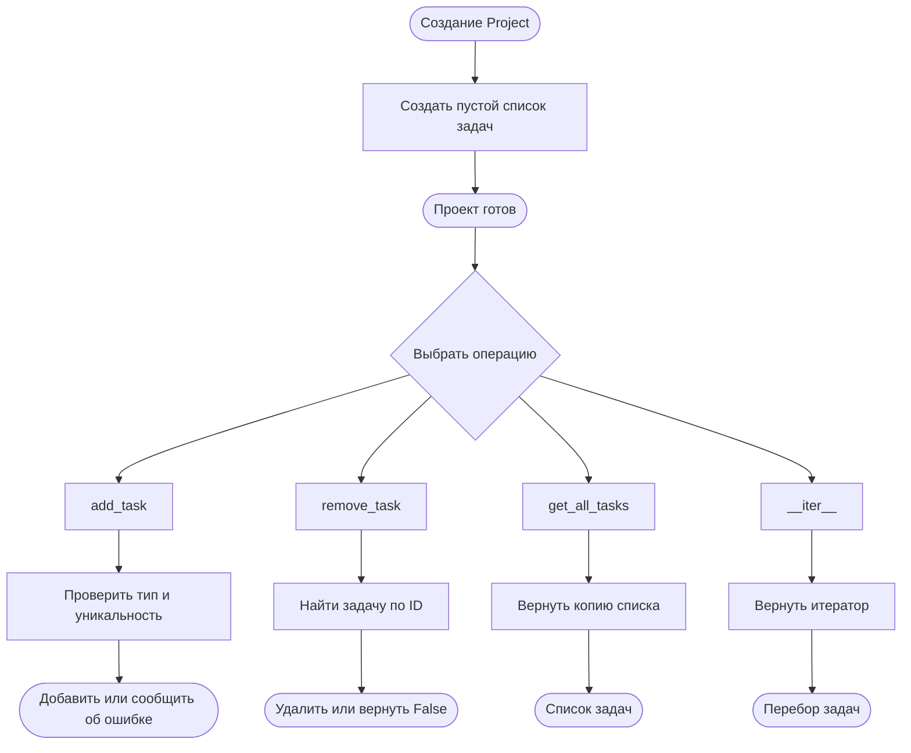
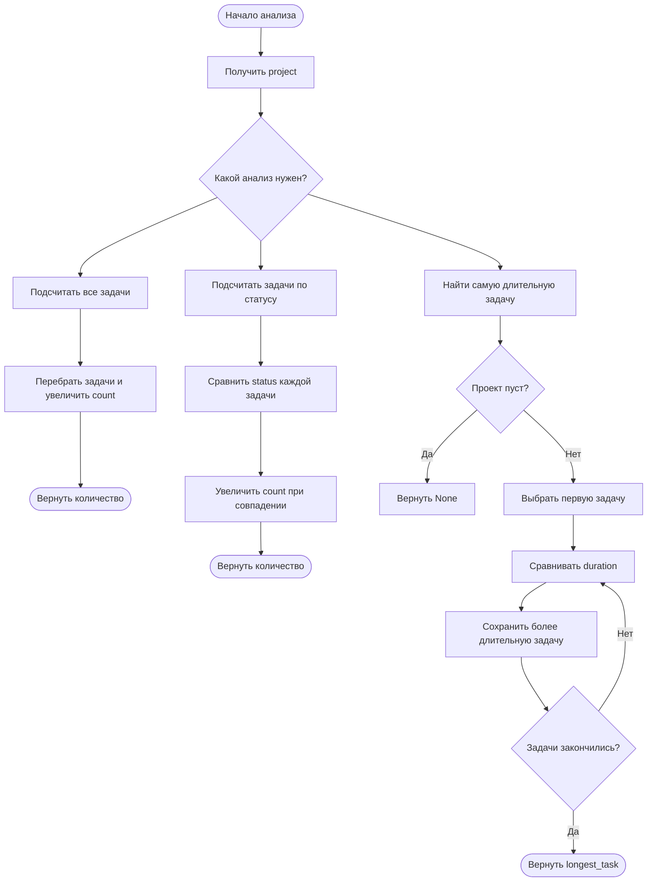
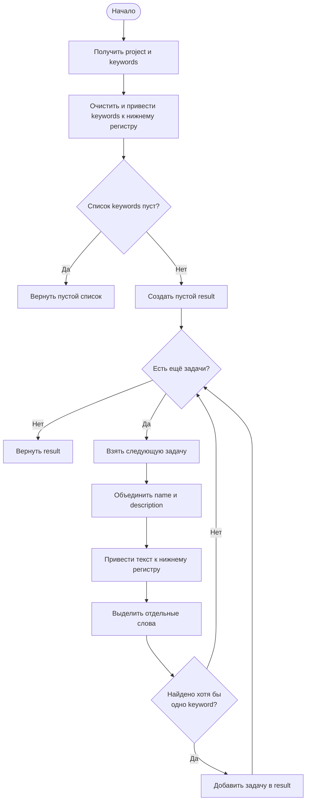
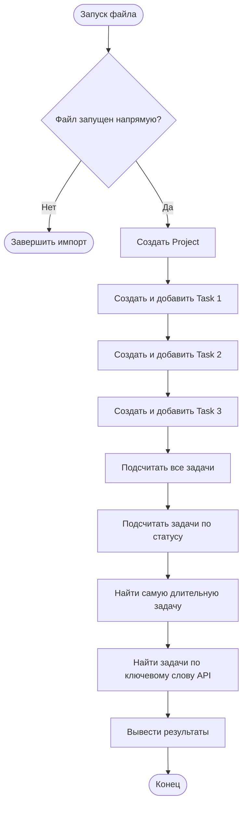

# Псевдокод и блок-схемы системы управления задачами

Документ подготовлен по прикреплённому Python-файлу. Он включает псевдокод всех основных классов и методов: `Task`, `Project`, `Analysis` и `EnhancedAnalysis`.

## 1. Общая структура

```text
Task
 ├─ task_id
 ├─ name
 ├─ description
 ├─ status
 ├─ duration
 ├─ геттеры и сеттеры
 └─ __repr__()

Project
 ├─ список задач
 ├─ add_task(task)
 ├─ remove_task(task_id)
 ├─ get_all_tasks()
 └─ __iter__()

Analysis
 ├─ count_tasks(project)
 ├─ count_tasks_by_status(project, status)
 └─ find_longest_task(project)

EnhancedAnalysis наследуется от Analysis
 └─ find_tasks_with_keywords(project, keywords)
```

## 2. Импорты и подготовка

```text
ПОДКЛЮЧИТЬ модуль re
    Используется для поиска отдельных слов в названии и описании задачи.

ПОДКЛЮЧИТЬ timedelta
    Используется для хранения длительности задачи.

ПОДКЛЮЧИТЬ Iterable и Iterator
    Используются для описания типов перебираемых объектов и итераторов.
```

## 3. Класс `Task`

### 3.1. Создание задачи

```text
АЛГОРИТМ СОЗДАНИЯ TASK

ВХОД:
    task_id      — целый идентификатор
    name         — название задачи
    description  — описание задачи
    status       — статус задачи
    duration     — длительность типа timedelta

ВЫЗВАТЬ set_task_id(task_id)
ВЫЗВАТЬ set_name(name)
ВЫЗВАТЬ set_description(description)
ВЫЗВАТЬ set_status(status)
ВЫЗВАТЬ set_duration(duration)

ЕСЛИ все проверки пройдены:
    СОЗДАТЬ объект Task
ИНАЧЕ:
    ВЫЗВАТЬ соответствующую ошибку

ВЕРНУТЬ объект Task
КОНЕЦ АЛГОРИТМА
```

### 3.2. Установка идентификатора

```text
АЛГОРИТМ SET_TASK_ID

ВХОД: task_id

ЕСЛИ task_id не является целым числом:
    ВЫЗВАТЬ TypeError

ЕСЛИ task_id является True или False:
    ВЫЗВАТЬ TypeError

СОХРАНИТЬ task_id во внутренний атрибут __task_id
КОНЕЦ АЛГОРИТМА
```

### 3.3. Установка названия

```text
АЛГОРИТМ SET_NAME

ВХОД: name

ЕСЛИ name не является строкой:
    ВЫЗВАТЬ ValueError

УДАЛИТЬ пробелы в начале и конце name

ЕСЛИ после очистки name пуст:
    ВЫЗВАТЬ ValueError

СОХРАНИТЬ очищенное name в __name
КОНЕЦ АЛГОРИТМА
```

### 3.4. Установка описания

```text
АЛГОРИТМ SET_DESCRIPTION

ВХОД: description

ЕСЛИ description не является строкой:
    ВЫЗВАТЬ TypeError

УДАЛИТЬ пробелы в начале и конце description
СОХРАНИТЬ результат в __description

КОНЕЦ АЛГОРИТМА
```

Описание может быть пустым, но обязательно должно быть строкой.

### 3.5. Установка статуса

```text
АЛГОРИТМ SET_STATUS

ВХОД: status

ЕСЛИ status не является строкой:
    ВЫЗВАТЬ ValueError

УДАЛИТЬ пробелы в начале и конце status

ЕСЛИ status пуст:
    ВЫЗВАТЬ ValueError

СОХРАНИТЬ очищенный status в __status
КОНЕЦ АЛГОРИТМА
```

### 3.6. Установка длительности

```text
АЛГОРИТМ SET_DURATION

ВХОД: duration

ЕСЛИ duration не является объектом timedelta:
    ВЫЗВАТЬ TypeError

ЕСЛИ duration меньше timedelta(0):
    ВЫЗВАТЬ ValueError

СОХРАНИТЬ duration в __duration
КОНЕЦ АЛГОРИТМА
```

### 3.7. Геттеры

```text
АЛГОРИТМЫ ГЕТТЕРОВ

get_task_id:
    ВЕРНУТЬ __task_id

get_name:
    ВЕРНУТЬ __name

get_description:
    ВЕРНУТЬ __description

get_status:
    ВЕРНУТЬ __status

get_duration:
    ВЕРНУТЬ __duration
```

### 3.8. Свойства

```text
СОЗДАТЬ свойство task_id:
    чтение выполняется через get_task_id
    изменение выполняется через set_task_id

СОЗДАТЬ свойство name:
    чтение выполняется через get_name
    изменение выполняется через set_name

СОЗДАТЬ свойство description:
    чтение выполняется через get_description
    изменение выполняется через set_description

СОЗДАТЬ свойство status:
    чтение выполняется через get_status
    изменение выполняется через set_status

СОЗДАТЬ свойство duration:
    чтение выполняется через get_duration
    изменение выполняется через set_duration
```

### 3.9. Представление задачи

```text
АЛГОРИТМ REPR_TASK

СФОРМИРОВАТЬ строку с:
    task_id
    name
    status
    duration

ВЕРНУТЬ сформированную строку
КОНЕЦ АЛГОРИТМА
```

## 4. Класс `Project`

### 4.1. Создание проекта

```text
АЛГОРИТМ СОЗДАНИЯ PROJECT

СОЗДАТЬ пустой список __tasks

ВЕРНУТЬ объект Project
КОНЕЦ АЛГОРИТМА
```

### 4.2. Добавление задачи

```text
АЛГОРИТМ ADD_TASK

ВХОД: task

ЕСЛИ task не является объектом Task:
    ВЫЗВАТЬ TypeError

ДЛЯ каждой existing_task в списке __tasks:
    ЕСЛИ existing_task.task_id равен task.task_id:
        ВЫЗВАТЬ ValueError

ДОБАВИТЬ task в конец списка __tasks
КОНЕЦ АЛГОРИТМА
```

### 4.3. Удаление задачи

```text
АЛГОРИТМ REMOVE_TASK

ВХОД: task_id

ДЛЯ каждой задачи task с индексом index:
    ЕСЛИ task.task_id равен task_id:
        УДАЛИТЬ задачу по индексу index
        ВЕРНУТЬ True

ЕСЛИ задача не найдена:
    ВЕРНУТЬ False

КОНЕЦ АЛГОРИТМА
```

### 4.4. Получение всех задач

```text
АЛГОРИТМ GET_ALL_TASKS

СОЗДАТЬ копию списка __tasks
ВЕРНУТЬ копию списка

КОНЕЦ АЛГОРИТМА
```

Копия нужна, чтобы внешний код не изменил внутренний список проекта напрямую.

### 4.5. Итератор проекта

```text
АЛГОРИТМ ITER_PROJECT

ВЕРНУТЬ итератор по списку __tasks

КОНЕЦ АЛГОРИТМА
```

Благодаря этому проект можно использовать в цикле:

```text
ДЛЯ каждой task в project:
    выполнить действие с task
```

### Блок-схема `Project`



## 5. Класс `Analysis`

Все методы класса `Analysis` являются статическими, потому что им не нужен отдельный объект анализа. Им достаточно получить объект `Project` в качестве параметра.

### 5.1. Подсчёт всех задач

```text
АЛГОРИТМ COUNT_TASKS

ВХОД: project

count = 0

ДЛЯ каждой задачи в project:
    count = count + 1

ВЕРНУТЬ count
КОНЕЦ АЛГОРИТМА
```

### 5.2. Подсчёт задач по статусу

```text
АЛГОРИТМ COUNT_TASKS_BY_STATUS

ВХОД:
    project
    status

count = 0

ДЛЯ каждой задачи task в project:
    ЕСЛИ task.status равен status:
        count = count + 1

ВЕРНУТЬ count
КОНЕЦ АЛГОРИТМА
```

### 5.3. Поиск самой длительной задачи

```text
АЛГОРИТМ FIND_LONGEST_TASK

ВХОД: project

ЕСЛИ project пуст:
    ВЕРНУТЬ None

longest_task = первая задача проекта

ДЛЯ каждой следующей задачи task:
    ЕСЛИ task.duration больше longest_task.duration:
        longest_task = task

ВЕРНУТЬ longest_task
КОНЕЦ АЛГОРИТМА
```

### Блок-схема анализа



## 6. Класс `EnhancedAnalysis`

```text
class EnhancedAnalysis наследуется от Analysis
```

Это означает, что `EnhancedAnalysis` автоматически получает методы `count_tasks`, `count_tasks_by_status` и `find_longest_task`, а также добавляет собственный метод поиска по ключевым словам.

### 6.1. Поиск задач по ключевым словам

```text
АЛГОРИТМ FIND_TASKS_WITH_KEYWORDS

ВХОД:
    project
    keywords — список ключевых слов

Создать пустой список normalized_keywords

ДЛЯ каждого keyword в keywords:
    УДАЛИТЬ пробелы по краям
    ПЕРЕВЕСТИ keyword в нижний регистр
    ЕСЛИ keyword не пуст:
        ДОБАВИТЬ keyword в normalized_keywords

ЕСЛИ normalized_keywords пуст:
    ВЕРНУТЬ пустой список

result = пустой список

ДЛЯ каждой задачи task в project:
    searchable_text = task.name + пробел + task.description
    ПЕРЕВЕСТИ searchable_text в нижний регистр

    words = выделить из searchable_text отдельные слова

    ЕСЛИ хотя бы одно keyword содержится в words:
        ДОБАВИТЬ task в result

ВЕРНУТЬ result
КОНЕЦ АЛГОРИТМА
```

### 6.2. Блок-схема поиска по ключевым словам



Поиск не зависит от регистра. Например, ключевое слово `api` совпадёт со словом `API`. При этом проверяются отдельные слова, а не случайные фрагменты внутри других слов.

## 7. Демонстрационный блок запуска

```text
АЛГОРИТМ MAIN

ЕСЛИ файл запущен напрямую:

    СОЗДАТЬ пустой Project

    СОЗДАТЬ Task 1:
        название = "Разработка API"
        статус = "выполняется"
        duration = 8 часов
    ДОБАВИТЬ Task 1 в project

    СОЗДАТЬ Task 2:
        название = "Тестирование API"
        статус = "ожидание"
        duration = 4 часа
    ДОБАВИТЬ Task 2 в project

    СОЗДАТЬ Task 3:
        название = "Документация"
        статус = "завершена"
        duration = 12 часов
    ДОБАВИТЬ Task 3 в project

    ВЫВЕСТИ общее количество задач
    ВЫВЕСТИ количество задач со статусом "выполняется"
    ВЫВЕСТИ самую длительную задачу
    ВЫВЕСТИ задачи, содержащие слово "API"

КОНЕЦ АЛГОРИТМА
```

### Блок-схема демонстрационной программы



## 8. Итоговая последовательность работы

```text
1. Создать объекты Task.
2. При создании проверить типы и значения атрибутов.
3. Создать объект Project.
4. Добавить задачи в проект.
5. Проверить уникальность task_id.
6. При необходимости удалить задачу по task_id.
7. Перебрать задачи через итератор.
8. Выполнить базовый анализ через Analysis.
9. Выполнить поиск по словам через EnhancedAnalysis.
10. Вывести результаты.
```
