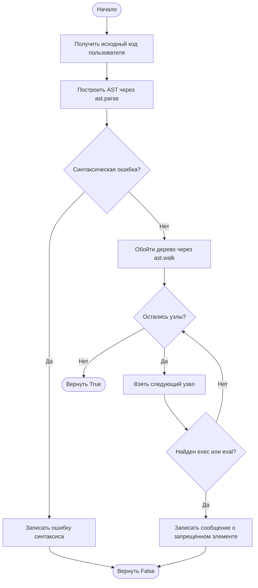
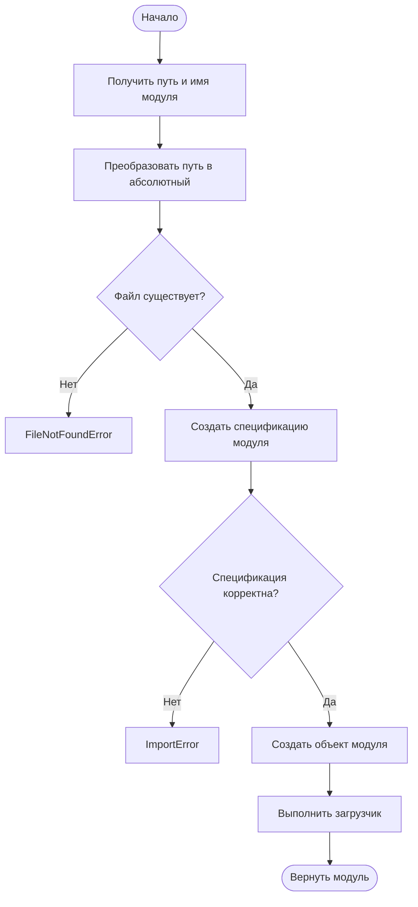
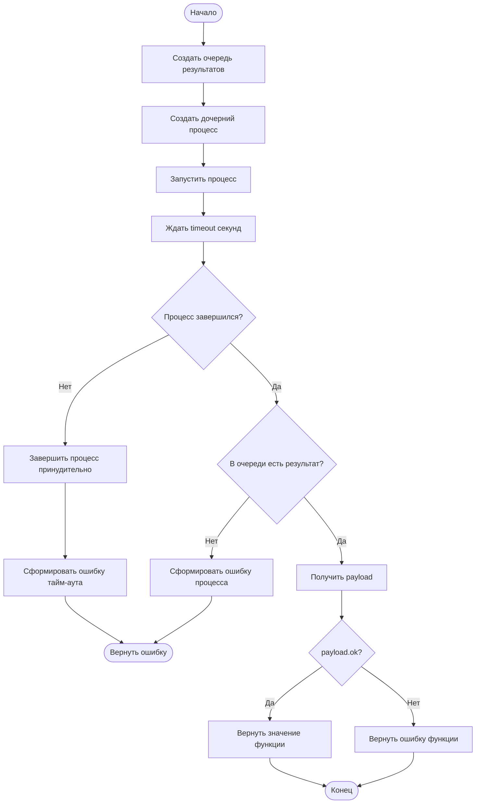
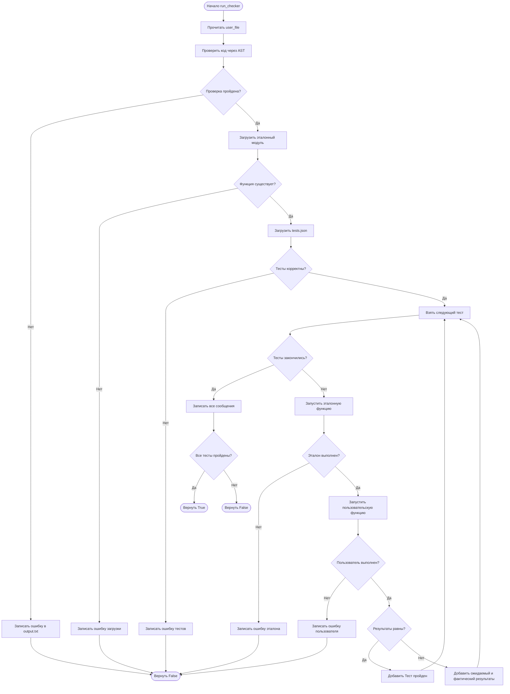
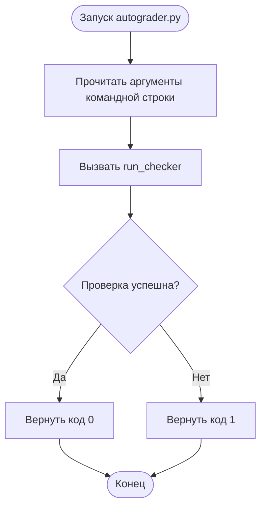

# Псевдокод и блок-схемы Python-автогрейдера

Документ описывает работу учебной системы автоматической проверки Python-кода: AST-проверку, динамическую загрузку модулей, запуск функций в отдельном процессе, ограничение времени и сравнение результатов с эталонным решением.

## 1. Общая архитектура

```text
Вход:
    standard_solution.py — эталонный код
    user_solution.py     — код пользователя
    tests.json            — тестовые случаи

                |
                v
        Проверка AST user_solution.py
                |
       +--------+--------+
       |                 |
    Ошибка              Успех
       |                 |
       v                 v
  output.txt      Загрузить модули
                         |
                         v
              Запустить тесты по очереди
                         |
                         v
           Сравнить результат пользователя
                  с эталонным
                         |
                         v
                    output.txt
```

## 2. Псевдокод `check_for_malicious_code`

```text
АЛГОРИТМ CHECK_FOR_MALICIOUS_CODE

ВХОД:
    code        — исходный код пользователя в виде строки
    output_file — файл для записи результата проверки

ПОПЫТАТЬСЯ:
    tree = ast.parse(code)

    ДЛЯ каждого node при обходе ast.walk(tree):

        ЕСЛИ node является атрибутом
        И имя атрибута равно "exec":
            СФОРМИРОВАТЬ ошибку:
                "Код содержит запрещенный атрибут: exec"
            ЗАПИСАТЬ ошибку в output_file
            ВЕРНУТЬ False

        ЕСЛИ node является именем
        И имя равно "exec":
            СФОРМИРОВАТЬ ошибку:
                "Код содержит запрещенное имя: exec"
            ЗАПИСАТЬ ошибку в output_file
            ВЕРНУТЬ False

        ЕСЛИ node является вызовом функции eval:
            СФОРМИРОВАТЬ ошибку:
                "Код содержит вызов eval()"
            ЗАПИСАТЬ ошибку в output_file
            ВЕРНУТЬ False

ЕСЛИ возникла SyntaxError:
    ЗАПИСАТЬ:
        "Ошибка при проверке модуля user_malicious:"
        "Код содержит синтаксическую ошибку: ..."
    ВЕРНУТЬ False

ЕСЛИ возникла другая ошибка:
    ЗАПИСАТЬ:
        "Ошибка при проверке модуля user_malicious:"
        "Код содержит вредоносные элементы: ..."
    ВЕРНУТЬ False

ВЕРНУТЬ True
КОНЕЦ АЛГОРИТМА
```

### Блок-схема AST-проверки



> AST-проверка — это фильтр для учебного задания. Она не является полноценной изоляцией недоверенного кода.

## 3. Псевдокод `load_module_from_path`

```text
АЛГОРИТМ LOAD_MODULE_FROM_PATH

ВХОД:
    file_path   — путь к Python-файлу
    module_name — имя будущего модуля

ПРЕОБРАЗОВАТЬ file_path в абсолютный путь

ЕСЛИ файл не существует:
    ВЫЗВАТЬ FileNotFoundError

СОЗДАТЬ спецификацию модуля

ЕСЛИ спецификация или загрузчик отсутствуют:
    ВЫЗВАТЬ ImportError

СОЗДАТЬ объект module из спецификации
ЗАПУСТИТЬ загрузчик модуля

ВЕРНУТЬ module
КОНЕЦ АЛГОРИТМА
```

### Блок-схема загрузки модуля



## 4. Псевдокод worker-процесса

```text
АЛГОРИТМ EXECUTE_FUNCTION_WORKER

ВХОД:
    file_path
    module_name
    function_name
    args
    kwargs
    result_queue

ПОПЫТАТЬСЯ:
    ЗАГРУЗИТЬ модуль из file_path
    ПОЛУЧИТЬ function по имени function_name
    result = function(*args, **kwargs)
    ПОЛОЖИТЬ в result_queue:
        ok = True
        value = result

ЕСЛИ возникла ошибка:
    ПОЛОЖИТЬ в result_queue:
        ok = False
        error = тип ошибки и её описание

КОНЕЦ АЛГОРИТМА
```

Worker выполняется не в основном процессе, а в дочернем. Это позволяет остановить функцию, если она зависла или выполняется слишком долго.

## 5. Псевдокод `execute_function`

```text
АЛГОРИТМ EXECUTE_FUNCTION

ВХОД:
    file_path
    module_name
    function_name
    args
    kwargs
    timeout

СОЗДАТЬ отдельный multiprocessing-контекст
СОЗДАТЬ очередь result_queue
СОЗДАТЬ процесс с target = EXECUTE_FUNCTION_WORKER

ЗАПУСТИТЬ процесс
ОЖИДАТЬ завершения не более timeout секунд

ЕСЛИ процесс всё ещё работает:
    ПРЕРВАТЬ процесс
    ДОЖДАТЬСЯ его завершения
    ВЕРНУТЬ:
        ok = False
        timed_out = True
        error = "Превышено ограничение времени"

ЕСЛИ очередь не содержит результата:
    ВЕРНУТЬ ошибку завершения процесса

ПОЛУЧИТЬ payload из очереди

ЕСЛИ payload.ok равно True:
    ВЕРНУТЬ:
        ok = True
        value = payload.value

ИНАЧЕ:
    ВЕРНУТЬ:
        ok = False
        error = payload.error

КОНЕЦ АЛГОРИТМА
```

### Блок-схема запуска с тайм-аутом



## 6. Псевдокод `load_test_cases`

```text
АЛГОРИТМ LOAD_TEST_CASES

ВХОД: test_file

ПРОЧИТАТЬ содержимое test_file
РАСПАРСИТЬ JSON

ЕСЛИ данные не являются списком:
    ВЫЗВАТЬ ValueError

СОЗДАТЬ пустой список cases

ДЛЯ каждого case в JSON-списке:
    ЕСЛИ case не является словарём:
        ВЫЗВАТЬ ValueError

    args = case["args"] или пустой список
    kwargs = case["kwargs"] или пустой словарь
    ДОБАВИТЬ args и kwargs в cases

ВЕРНУТЬ cases
КОНЕЦ АЛГОРИТМА
```

## 7. Псевдокод `run_checker`

```text
АЛГОРИТМ RUN_CHECKER

ВХОД:
    standard_file — эталонный Python-файл
    user_file     — пользовательский Python-файл
    tests_file    — JSON-файл тестов
    output_file   — файл результатов
    function_name — имя проверяемой функции
    timeout       — лимит времени

ПРОЧИТАТЬ user_file

ВЫЗВАТЬ check_for_malicious_code(user_code, output_file)

ЕСЛИ AST-проверка не пройдена:
    ОСТАНОВИТЬ проверку
    ВЕРНУТЬ False

ПОПЫТАТЬСЯ:
    ЗАГРУЗИТЬ эталонный модуль
    ПРОВЕРИТЬ наличие function_name

ЕСЛИ загрузка эталона не удалась:
    ЗАПИСАТЬ ошибку в output_file
    ВЕРНУТЬ False

ЗАГРУЗИТЬ тестовые случаи через load_test_cases

ЕСЛИ загрузка тестов не удалась:
    ЗАПИСАТЬ ошибку в output_file
    ВЕРНУТЬ False

СОЗДАТЬ пустой список messages

ДЛЯ каждого тестового случая case:

    expected = execute_function(
        standard_file,
        function_name,
        case.args,
        case.kwargs,
        timeout
    )

    ЕСЛИ эталон завершился ошибкой:
        ЗАПИСАТЬ ошибку эталонного кода
        ВЕРНУТЬ False

    actual = execute_function(
        user_file,
        function_name,
        case.args,
        case.kwargs,
        timeout
    )

    ЕСЛИ пользовательский код завершился ошибкой:
        ЗАПИСАТЬ:
            "Ошибка при выполнении кода пользователя: ..."
        ВЕРНУТЬ False

    ЕСЛИ actual.value равен expected.value:
        ДОБАВИТЬ "Тест пройден" в messages
    ИНАЧЕ:
        ДОБАВИТЬ "Тест не пройден"
        ДОБАВИТЬ ожидаемый результат
        ДОБАВИТЬ результат пользователя

ЗАПИСАТЬ messages в output_file

ЕСЛИ все сообщения равны "Тест пройден":
    ВЕРНУТЬ True
ИНАЧЕ:
    ВЕРНУТЬ False

КОНЕЦ АЛГОРИТМА
```

### Блок-схема полного автотестирования



## 8. Псевдокод формата отчёта

### Успешный тест

```text
ЕСЛИ результат пользователя равен эталонному:
    ЗАПИСАТЬ в output.txt:
        Тест пройден
```

### Непройденный тест

```text
ИНАЧЕ:
    ЗАПИСАТЬ:
        Тест не пройден
        Ожидаемый результат: expected
        Результат пользователя: actual
```

### Ошибка пользователя

```text
ЕСЛИ пользовательская функция вызвала исключение:
    ЗАПИСАТЬ:
        Ошибка при выполнении кода пользователя: описание ошибки
    ОСТАНОВИТЬ автопроверку
```

### Превышение времени

```text
ЕСЛИ процесс выполняется дольше timeout секунд:
    ОСТАНОВИТЬ процесс
    ЗАПИСАТЬ:
        Ошибка при выполнении кода пользователя:
        Превышено ограничение времени: timeout секунд
    ОСТАНОВИТЬ автопроверку
```

## 9. Псевдокод запуска из командной строки

```text
АЛГОРИТМ MAIN

ПОЛУЧИТЬ аргументы командной строки:
    standard_file
    user_file
    tests_file
    output_file
    function_name
    timeout

ВЫЗВАТЬ run_checker с полученными аргументами

ЕСЛИ run_checker вернул True:
    ВЕРНУТЬ код завершения 0
ИНАЧЕ:
    ВЕРНУТЬ код завершения 1

КОНЕЦ АЛГОРИТМА
```

### Блок-схема CLI-запуска



## 10. Полный сценарий работы

```text
1. Пользователь запускает autograder.py.
2. Автогрейдер получает пути к эталону, решению пользователя и тестам.
3. Исходный код пользователя анализируется через AST.
4. Если найден запрещённый элемент, создаётся отчёт об ошибке.
5. Если AST-проверка пройдена, загружается эталонный модуль.
6. Загружается JSON со списком тестов.
7. Для каждого теста запускается эталонная функция.
8. Для каждого теста запускается пользовательская функция.
9. Оба запуска выполняются в отдельных процессах.
10. Если процесс завис, он завершается после тайм-аута.
11. Результаты сравниваются.
12. В output.txt записывается итог каждого теста.
13. При первой ошибке выполнения проверка останавливается.
14. Программа возвращает код 0 при полном успехе или код 1 при ошибке.
```
